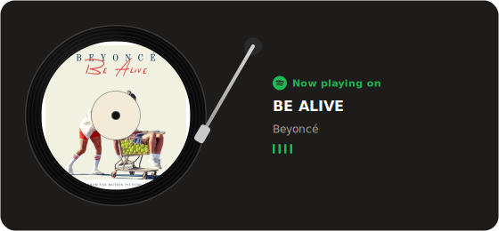

[](./LICENSE)
[](https://vercel.com/new/clone?repository-url=https%3A%2F%2Fgithub.com%2Fwendy-wej%2Fspotify-vinyl-widget&env=SPOTIFY_CLIENT_ID,SPOTIFY_CLIENT_SECRET,SPOTIFY_REFRESH_TOKEN&envDescription=Spotify%20API%20credentials%20%E2%80%94%20see%20the%20README%27s%20%22Create%20a%20Spotify%20app%22%20and%20%22Get%20a%20refresh%20token%22%20steps&envLink=https%3A%2F%2Fgithub.com%2Fwendy-wej%2Fspotify-vinyl-widget%23readme&project-name=spotify-vinyl-widget&repository-name=spotify-vinyl-widget)

# Spotify Vinyl Widget

A spinning-vinyl "Now Playing on Spotify" widget for your GitHub profile README, rebuilt here
as a serverless endpoint that renders a live, self-updating SVG.




This is free and open source (MIT licensed) — anyone can deploy their own copy.
There's no shared server and no sign-up: each person runs their own instance
under their own free Vercel account, connected to their own Spotify account.

Do steps 1–2 below first (create a Spotify app, get your refresh token) —
you'll need those three values to paste in when the Deploy button asks for
them. Then click "Deploy with Vercel" above to skip steps 3–4, or keep
following the manual steps all the way through.

## How it works

GitHub profile READMEs can't run JavaScript, so this doesn't ship the interactive
component from the design — instead, `api/spotify.js` is a serverless function
that:

1. Refreshes a Spotify access token from a saved refresh token.
2. Asks Spotify what you're currently playing (falling back to your most
   recently played track if nothing's active).
3. Renders an SVG card — spinning vinyl with your real album art, animated EQ
   bars, tonearm angle — that updates every time the image is requested.

You embed the deployed URL as an `` in your GitHub profile README, and it
looks live because it *is* live.

## 1. Create a Spotify app

1. Go to the [Spotify Developer Dashboard](https://developer.spotify.com/dashboard) and create an app.
2. Add `http://127.0.0.1:8888/callback` as a Redirect URI in the app's settings (needed once, for step 2 below).
3. Note the **Client ID** and **Client Secret**.

## 2. Get a refresh token

```bash
npm install
cp .env.example .env
# fill in SPOTIFY_CLIENT_ID and SPOTIFY_CLIENT_SECRET in .env
npm run get-refresh-token
```

This opens a browser, asks you to authorize the app against your own Spotify
account, then prints a `SPOTIFY_REFRESH_TOKEN` to paste into `.env`.

## 3. Run it locally (optional)

```bash
npm run dev
# then open http://localhost:3000/api/spotify
```

## 4. Deploy

Already used the "Deploy with Vercel" button above? You're done — skip to step 5.

Otherwise, deploy to [Vercel](https://vercel.com) manually (free tier is enough):

```bash
npx vercel
```

Then set the three env vars from your `.env` in the Vercel project settings
(Project → Settings → Environment Variables) and redeploy.

## 5. Embed it in your GitHub profile README

```markdown

```

Add `?theme=light` for the light card:

```markdown

```

## Notes

- The card shows "Recently played" (tonearm lifted, EQ bars still) when
  nothing is currently playing, and "Now playing" (spinning, animated bars)
  when it is.
- Spotify refresh tokens don't expire under normal use, so you shouldn't need
  to redo step 2 — if the widget ever starts showing an error, regenerate one.

